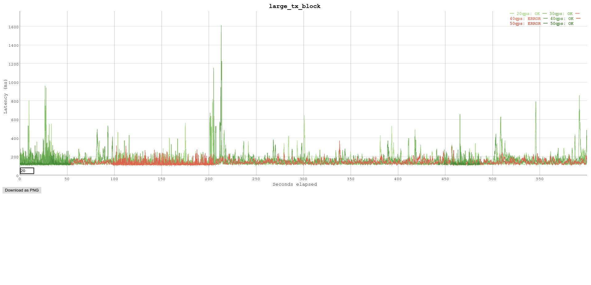
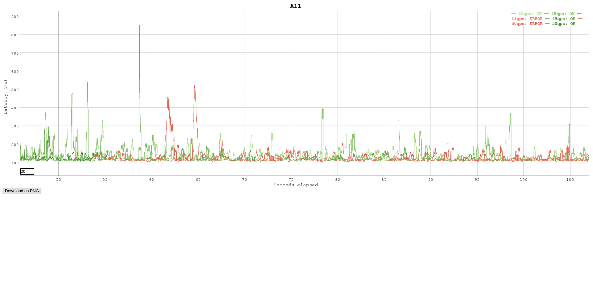
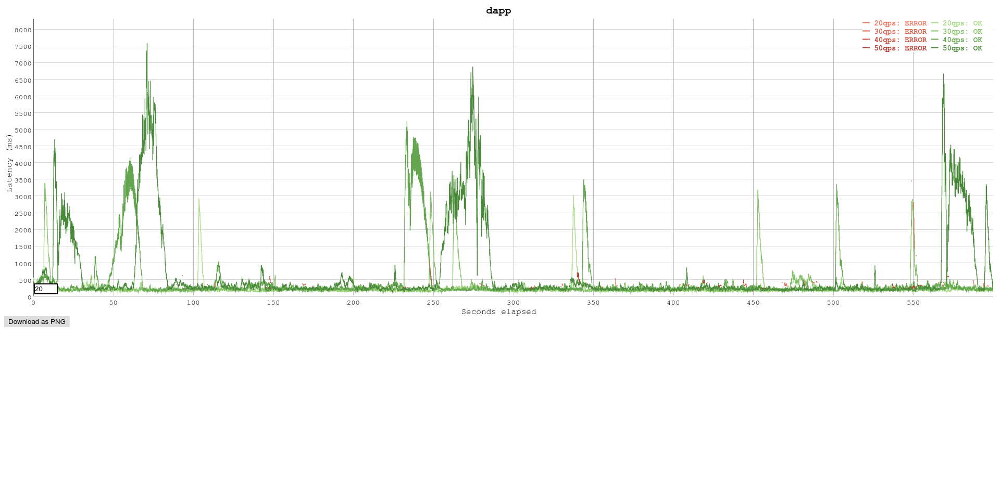
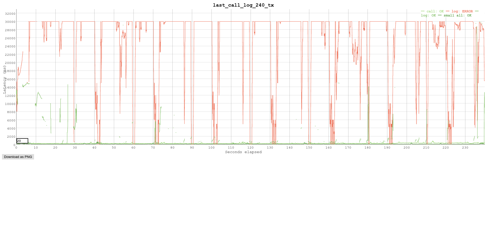
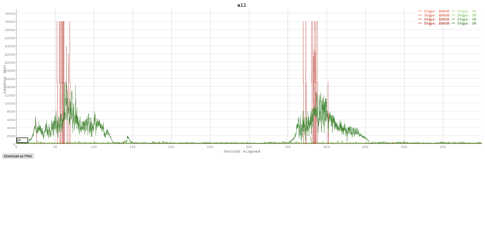
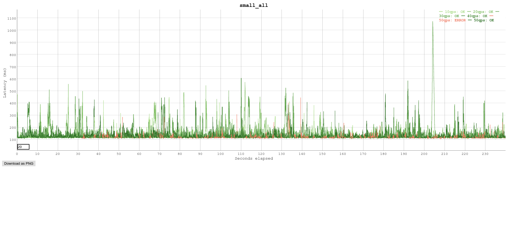
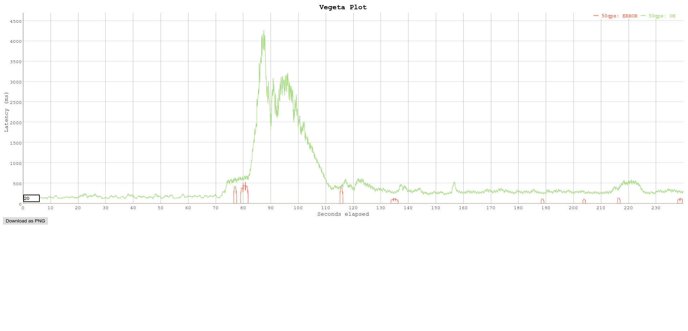
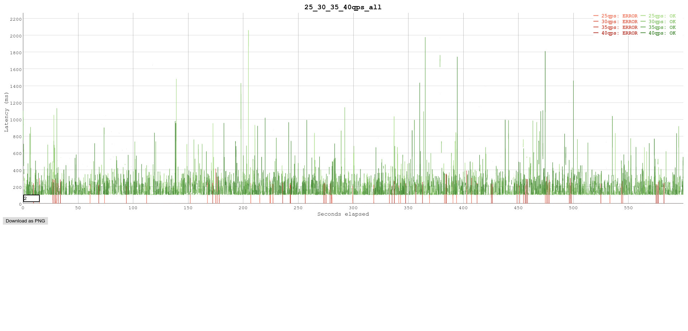
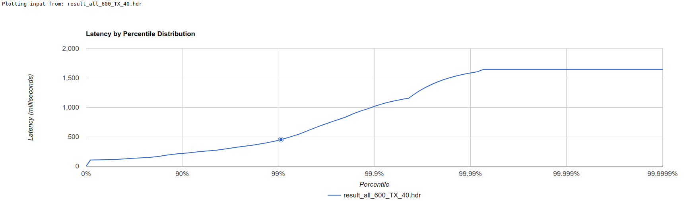

# Ethereum API

This API will expose methods to call an ethereum node.
It comes with an OpenAPI documentation directly accessible at this endpoint [http://localhost:8000/swaggerui/](http://localhost:8000/swaggerui/)
We are also describing a load testing methodologie and some load testing results on the node.

# API

## Get started

Unless you have a node where you can connect to directly you can use INFURA.

Copy the `app_example.yaml` file to `app.yaml`.
Register for an [INFURA Project ID](https://infura.io/register) and update the app.yaml's NODE_URL var accordingly.

To start the API from a laptop with go installed

```shell
go run cmd/main.go
```

To start the API from docker

```shell
docker build -t infura/api .
docker run -p 8000:8000 -d infura/api
```

you can then navigate to [http://localhost:8000](http://localhost:8000/)
you should see

```json
{ "ok": true }
```

you can then navigate to [http://localhost:8000/swaggerui/](http://localhost:8000/swaggerui/) to have the full API description

you can tweak the configuration in the `app.yml` file

## Description

A clear definition of the API is porvided by using swagger to describe the API and to easily generate documentation and code based on
the description.

`routes.go` operations are annotated so that the swagger specification file can be generated with a simple command `swagger generate spec -o ./swagger.json`
the documentation can be found at this endpoint [http://localhost:8000/swaggerui/](http://localhost:8000/swaggerui/). Note that as the models are imported from an external package we can't take advantage of the automatic swagger:model generation.

We use [mux](https://github.com/gorilla/mux) to provide http routing.
Our API will basically expose an ethereum node reading capability we don't need a lot of business logic inside just convenient output conversion depending on the endpoints. Also we don't need the websocket as we don't provide websocket fonctionality on our API yet.

Our API only expose GET methods because we are not creating resources but only serving them. For some endpoints like `/call` where there are several parameters we could have use a POST method especially if we need optional parameters. As we added this endpoint for load testing purposes we will only use a GET method.
We don't have caching on the API yet.

## Helpers for JRPC call to INFURA node

Instead of reinventing the wheel and use directly ethclient from go-ethereum we use the convenient helpers from github.com/INFURA/go-ethlibs/. It already defines all the needed structs for transactions, blocks and more.

It massivily uses interfaces and it is well tested (82% code coverage on eth/). client in `/node/client.go` has been extended to be able to handle more methods.

## logging

I picked uber [zap](https://godoc.org/go.uber.org/zap) because of

- its small footprint on CPU and I/O. It samples logs so that zap begins dropping duplicates to preserve throughput.
- variety of encoding
- different log levels
- outputPaths: we can use a list of url to write output to e.g. `{stderr,"tmp/logs","https://my.logger.com"}`
  Here performance is nice, but not critical, so I used the SugaredLogger. It's 4-10x faster than other structured logging packages and supports both structured and printf-style logging.

## Configuration Management

We use [Viper](https://github.com/spf13/viper) for configuration management.
We use variable from ENV to facilitate variable overriding especially in Docker file or Kubernetes deployment for instance.

## Unit Testing

The handlers are tested in the `handlers` directory to run them

```shell
go test ./handlers -v
```

## Way to improve

- Automatize the swagger spec generation for swagger ui in the dockerfile

- Add a grpc server

we could easily transform our API description into a protobuf to serve the resources via gRPC. gRPC is multiplexed binary streams on a TCP socket wich make it more efficient than REST API especially if our API needs to talk to client that can accomodate a tcp connection. Note that it is feasible to have a proxy in front of our API to serve HTTP with Envoy and GRPC web for the client. I have setup our [lab](https://lab.cogarius.com/experiment/blockchain/tour/wallet) experiment on fueling a local storage wallet this way.

- Versioning API

we can implement versioning with a header to route like this
`.header(apiv1)` in mux or directly in the path `api/v1/`

- Authentication and security

handles HTTPS, CORS and authentication with jwt token for instance. In a previous project we did a jwt issuance based on a challenge that the client should sign to verify his pubkey.

- Caching strategy

It can drastically improve performance to have a layer of caching. We can either add a caching layer for all routes but it can be very demanding for memory or we could first gather some metrics to identify which routes are computing heavy or frequently requested. Once the strategy is established we can implement it with the best tools for the job wether it is a redis database, in-memory or a CDN.

## Dockerfile

The docker file is a two stages build. The first stage build the binary using an alpine golang image. The second stage take a scratch image and copy the binary resulting in a very light (<12MB) image for our API.

# Load testing

## Why load testing

The goal is to load test the API and consequently the production nodes of Infura to determine how well the application is performing.
This helps identify the bottlenecks in the system under various workloads and checks how the system reacts when the load is gradually increased.

Based on those results we can understand what are the improvements that we need to do in our architecture or infrastructure.
It is **not** about finding when the system break it as about what is acceptable
it is how many request/sec can we do sustainably.

We will try to establish the limits and test the sustainable throughputs in between to determine a SLA that we can reasonably provide to our customers.
We want to know how many request per second our API can handle without throwing any errors and guarantee a wait time and latencies under 1 second.

## What metrics should matter

We will **not** look at average because you can have a great average with 1% of the request hitting 5sec. We can look at the [Anscombe quartet](https://en.wikipedia.org/wiki/Anscombe%27s_quartet) to visually see that with very different data sets we can have the same average.

Indeed most of the benchmark tools use the service time to represent the latency, but do not include the waiting time. It is the same thing if you are in queue in a restaurant you may wait two hours but the waiter will wrap up your meal in five minutes.

Let's take the example of a test tool where you execute the test request one after the other. What if the server hangs up ? The client must wait the response of the last request and then send the next request.
So we may only have one long request and the ones after may answer within an acceptable timeframe. It is called the [coordinated omission](http://highscalability.com/blog/2015/10/5/your-load-generator-is-probably-lying-to-you-take-the-red-pi.html)
Now what if like in vegeta we take advantage of the golang concurrency to send a request every 100milliseconds. If the server hangs up we will have much more requests failing.

In conclusion, to avoid vanity metrics we will look at the higher percentile greater than 95 and greather than 99 and at the wait time. Thanks to vegeta we have a consistent load testing and some great metrics to analyse.

## Where to test

I will use the mainnet and no cache on the API. We will launch the API in a container on my laptop.
We will make sure that the CPU is idle (<5% usage)
The goal here is to identify the hardware and network resources for the test. This way our conclusion can only extends to those resource requirements.

## How to test

We will use vegeta to find the rate at wich users can call our api and be pretty sure that no errors will happen and that wait time and latencies will stay under 1 second
We will use the attack command with different rates during 4 and 10 minutes with different sets of targets.
We will then be able to get a report and plot based on those results.

e.g.

```
vegeta attack -duration=600s -name=50qps -rate=50 -targets=dapp_targets.txt | tee result_dapp_600_TX_50.bin | vegeta report; \
vegeta plot --title dapp result_dapp_600_TX_50.bin  > plot_dapp.html;
```

## What to test

We don't have any data about how customers are using our API. In this case we will adopt a pragmatic approach testing all the endpoints in a first target group.
In the second target group we will simulate a dapp using Infura and calling endpoints such as gasprice/log/ call/ and balance/.
In the third group to be as close as possible to what we think is a real workload we have generated a huge target file for long run load testing getting transactions and block information of the last blocks.

Scenario 1: lots of blocks and transactions by hash and by height.
Scenario 2: more dapp oriented endpoints.
Scenario 3: all the endpoints.

We run load tests during four minutes making 20, 30, 40 and 50 requests per second requests and 10 minutes of tests.

## Analysis

### blocks and transactions by hash and by height

Let's take a large set of [block and transactions targets](load_testing/plot/large_tx_block_targets.txt) and try different rate begining with 20 requests per second till 50qps.
First of all we can see that the more we are getting [close to 50qps to more errors](load_testing/plot/plot_large_tx_block.html) we receive. Errors began to show at around 1 minute for 40qps but mainly for 50qps.


```
$ vegeta report result_large_600_TX_20.bin
Requests      [total, rate, throughput]  12000, 20.00, 20.00
Duration      [total, attack, wait]      10m0.06931754s, 9m59.949915266s, 119.402274ms
Latencies     [mean, 50, 95, 99, max]    129.646586ms, 116.869184ms, 191.974537ms, 366.757333ms, 1.186356736s
Bytes In      [total, mean]              13758393, 1146.53
Bytes Out     [total, mean]              0, 0.00
Success       [ratio]                    100.00%
Status Codes  [code:count]               200:12000
Error Set:
$ vegeta report result_large_600_TX_30.bin
Requests      [total, rate, throughput]  18000, 30.00, 29.99
Duration      [total, attack, wait]      10m0.160066932s, 9m59.966610417s, 193.456515ms
Latencies     [mean, 50, 95, 99, max]    131.660945ms, 116.621384ms, 200.007574ms, 396.106977ms, 1.267509789s
Bytes In      [total, mean]              18065819, 1003.66
Bytes Out     [total, mean]              0, 0.00
Success       [ratio]                    100.00%
Status Codes  [code:count]               200:18000
Error Set:
$ vegeta report result_large_600_TX_40.bin
Requests      [total, rate, throughput]  24000, 40.00, 32.89
Duration      [total, attack, wait]      10m0.423406944s, 9m59.974999785s, 448.407159ms
Latencies     [mean, 50, 95, 99, max]    128.119828ms, 115.945724ms, 188.615926ms, 342.365998ms, 5.516379547s
Bytes In      [total, mean]              19201633, 800.07
Bytes Out     [total, mean]              0, 0.00
Success       [ratio]                    82.27%
Status Codes  [code:count]               200:19745  404:4255
Error Set:
404 Not Found
$ vegeta report result_large_600_TX_50.bin
Requests      [total, rate, throughput]  30000, 50.00, 6.48
Duration      [total, attack, wait]      10m0.112140859s, 9m59.980012211s, 132.128648ms
Latencies     [mean, 50, 95, 99, max]    120.121933ms, 112.633178ms, 159.390225ms, 268.988345ms, 1.776706949s
Bytes In      [total, mean]              8706126, 290.20
Bytes Out     [total, mean]              0, 0.00
Success       [ratio]                    12.95%
Status Codes  [code:count]               200:3886  404:26114
Error Set:
404 Not Found

```

we can see that the latencies for 20 and 30 qps are quite similar. Indeed we have a small overhead of 7% on the max percentil but we have 62% increase in wait time for 30qps. Error count for 50qps went through the roof with 87% of the requests while error count for 40 qps is 17.7%.
Here we suspect that the rate limiter is kicking off when we are close to the rate limit.

So Let's take again a large set of [block and transactions targets](load_testing/plot/large_targets.txt) and try different rate begining with 40 requests per second till 50qps for 4 minutes.
First of all we can see that the more we are getting [close to 50qps to more errors](load_testing/plot/plot_block_trans_40_45_48_49_50.html) we receive. Errors began to show at around 1 minute. It is probably the time needed to calculate the qps and start dropping requests.



```
$ vegeta report result_large_240_TX_45.bin
Requests      [total, rate, throughput]  10800, 45.00, 44.98
Duration      [total, attack, wait]      4m0.08509414s, 3m59.977665744s, 107.428396ms
Latencies     [mean, 50, 95, 99, max]    122.917499ms, 111.109155ms, 180.770552ms, 338.825111ms, 1.103847945s
Bytes In      [total, mean]              12976660, 1201.54
Bytes Out     [total, mean]              0, 0.00
Success       [ratio]                    100.00%
Status Codes  [code:count]               200:10800
Error Set:
$ vegeta report result_large_240_TX_48.bin
Requests      [total, rate, throughput]  11520, 48.00, 47.98
Duration      [total, attack, wait]      4m0.094285839s, 3m59.979016845s, 115.268994ms
Latencies     [mean, 50, 95, 99, max]    125.554344ms, 111.259104ms, 189.920514ms, 387.320292ms, 1.230956746s
Bytes In      [total, mean]              13460189, 1168.42
Bytes Out     [total, mean]              0, 0.00
Success       [ratio]                    100.00%
Status Codes  [code:count]               200:11520
Error Set:
$ vegeta report result_large_240_TX_49.bin
Requests      [total, rate, throughput]  11760, 49.00, 27.44
Duration      [total, attack, wait]      4m0.374899002s, 3m59.979488597s, 395.410405ms
Latencies     [mean, 50, 95, 99, max]    121.360359ms, 109.862227ms, 176.38182ms, 343.279491ms, 1.245670147s
Bytes In      [total, mean]              10129919, 861.39
Bytes Out     [total, mean]              0, 0.00
Success       [ratio]                    56.09%
Status Codes  [code:count]               200:6596  404:5164
Error Set:
404 Not Found
$ vegeta report result_large_240_TX_50.bin
Requests      [total, rate, throughput]  12000, 50.00, 11.10
Duration      [total, attack, wait]      4m0.084295503s, 3m59.979926614s, 104.368889ms
Latencies     [mean, 50, 95, 99, max]    121.420196ms, 108.76761ms, 173.928269ms, 368.307985ms, 1.162858442s
Bytes In      [total, mean]              7481512, 623.46
Bytes Out     [total, mean]              0, 0.00
Success       [ratio]                    22.21%
Status Codes  [code:count]               200:2665  404:9335

```

we can see that the latencies for all the different qps are quite similar and consistent but at 49qps we end up with 5k errors and it is twice as big at 50qps. To conclude we can say that the rate limiter is doing a good job !

### Dapp

We will test with [a set of endpoints that would be call by a typical dapp](load_testing/plot/dapp_targets.txt) and try different rate begining with 20 requests per second till 50qps for 10 minutes each.

```
vegeta attack -duration=600s -name=20qps -rate=20 -targets=dapp_targets.txt | tee result_dapp_600_TX_20.bin | vegeta report; \
vegeta attack -duration=600s -name=30qps -rate=30 -targets=dapp_targets.txt | tee result_dapp_600_TX_30.bin | vegeta report; \
vegeta attack -duration=600s -name=40qps -rate=40 -targets=dapp_targets.txt | tee result_dapp_600_TX_40.bin | vegeta report; \
vegeta attack -duration=600s -name=50qps -rate=50 -targets=dapp_targets.txt | tee result_dapp_600_TX_50.bin | vegeta report; \
vegeta plot --title dapp result_dapp_600_TX_20.bin result_dapp_600_TX_30.bin result_dapp_600_TX_40.bin result_dapp_600_TX_50.bin > plot_dapp.html; \
```

When running with the [dapp endpoints](load_testing/plot/plot_dapp.html) we can see that the latencies are quite different from the previous load testing with only block and transaction endpoints. Although the latencies are much worst error rate is much better. Indeed even at 50qps we don't have many errors only 87 for 30 000 requests. On the plot we can see that there are big waves where the latencies goes up and get back to low level. We have an accumulation and then a discharge. Higher the rate is bigger the accumulation is. Maybe there is some kind of mechanism that is triggered at some point to help handling the overload.



```
$ vegeta report result_dapp_600_TX_20.bin
Requests      [total, rate, throughput]  12000, 20.00, 19.93
Duration      [total, attack, wait]      10m0.177040769s, 9m59.94983164s, 227.209129ms
Latencies     [mean, 50, 95, 99, max]    185.776508ms, 120.781775ms, 346.084695ms, 853.638318ms, 3.769329019s
Bytes In      [total, mean]              389587005, 32465.58
Bytes Out     [total, mean]              0, 0.00
Success       [ratio]                    99.67%
Status Codes  [code:count]               200:11961  404:39
Error Set:
404 Not Found
$ vegeta report result_dapp_600_TX_30.bin
Requests      [total, rate, throughput]  18000, 30.00, 29.88
Duration      [total, attack, wait]      10m0.172891383s, 9m59.966633986s, 206.257397ms
Latencies     [mean, 50, 95, 99, max]    233.396348ms, 130.840514ms, 464.111296ms, 2.349307974s, 4.126239055s
Bytes In      [total, mean]              586158667, 32564.37
Bytes Out     [total, mean]              0, 0.00
Success       [ratio]                    99.62%
Status Codes  [code:count]               200:17931  404:69
Error Set:
404 Not Found
$ vegeta report result_dapp_600_TX_40.bin
Requests      [total, rate, throughput]  24000, 40.00, 39.87
Duration      [total, attack, wait]      10m0.298415086s, 9m59.9749814s, 323.433686ms
Latencies     [mean, 50, 95, 99, max]    309.227381ms, 154.068714ms, 1.178536205s, 3.04809783s, 7.402382747s
Bytes In      [total, mean]              786610106, 32775.42
Bytes Out     [total, mean]              0, 0.00
Success       [ratio]                    99.73%
Status Codes  [code:count]               200:23936  404:64
Error Set:
404 Not Found
$ vegeta report result_dapp_600_TX_50.bin
Requests      [total, rate, throughput]  30000, 50.00, 49.83
Duration      [total, attack, wait]      10m0.28589256s, 9m59.979801054s, 306.091506ms
Latencies     [mean, 50, 95, 99, max]    458.664411ms, 190.157772ms, 1.867127105s, 4.356820387s, 9.311962998s
Bytes In      [total, mean]              1030344465, 34344.82
Bytes Out     [total, mean]              0, 0.00
Success       [ratio]                    99.71%
Status Codes  [code:count]               200:29913  404:87
Error Set:
404 Not Found
```

Let's take a focus on some endpoints like [call, log and tx & block](load_testing/plot/plot_last_call_log.html).
We can see that the rate at which where are requesting call endpoint is way too much. We don't even have one success request.
This call involve a lot of data being process and sent in the network. We can safely guess that this call is not cached otherwise
we would see a huge response time at the beginning and then the latency would be even out.

```
$ vegeta attack -duration=240s -name=log -rate=40 -targets=log_target.txt | tee result_log_240_TX_40.bin | vegeta report
Requests      [total, rate, throughput]  9600, 40.00, 0.00
Duration      [total, attack, wait]      4m25.849882348s, 3m59.974813918s, 25.87506843s
Latencies     [mean, 50, 95, 99, max]    25.477993906s, 30.000130118s, 30.00022268s, 30.000298606s, 30.000466698s
Bytes In      [total, mean]              1052, 0.11
Bytes Out     [total, mean]              0, 0.00
Success       [ratio]                    0.00%
Status Codes  [code:count]               0:9591  404:9
Error Set:
404 Not Found
Get http://localhost:8000/log/0x8B6492/0x8B649C/0xddf252ad1be2c89b69c2b068fc378daa952ba7f163c4a11628f55a4df523b3ef: dial tcp: lookup localhost: device or resource busy
```



### All endpoints

We will test with [all the available endpoints](load_testing/plot/all_targets.txt) and try different rate begining with 20 requests per second till 50qps for 4 and 10 minutes each.

```
vegeta attack -duration=600s -name=20qps -rate=20 -targets=all_targets.txt | tee result_all_600_TX_20.bin | vegeta report; \
vegeta attack -duration=600s -name=30qps -rate=30 -targets=all_targets.txt | tee result_all_600_TX_30.bin | vegeta report; \
vegeta attack -duration=600s -name=40qps -rate=40 -targets=all_targets.txt | tee result_all_600_TX_40.bin | vegeta report; \
vegeta attack -duration=600s -name=50qps -rate=50 -targets=all_targets.txt | tee result_all_600_TX_50.bin | vegeta report; \
vegeta plot --title all result_all_600_TX_20.bin result_all_600_TX_30.bin result_all_600_TX_40.bin result_all_600_TX_50.bin > plot_all_600.html; \
vegeta attack -duration=240s -name=10qps -rate=10 -targets=all_targets.txt | tee result_small_all_240_TX_10.bin | vegeta report; \
vegeta attack -duration=240s -name=20qps -rate=20 -targets=all_targets.txt | tee result_small_all_240_TX_20.bin | vegeta report; \
vegeta attack -duration=240s -name=30qps -rate=30 -targets=all_targets.txt | tee result_small_all_240_TX_30.bin | vegeta report; \
vegeta attack -duration=240s -name=40qps -rate=40 -targets=all_targets.txt | tee result_small_all_240_TX_40.bin | vegeta report; \
vegeta attack -duration=240s -name=50qps -rate=50 -targets=all_targets.txt | tee result_small_all_240_TX_50.bin | vegeta report; \
vegeta plot --title small_all result_small_all_240_TX_10.bin result_small_all_240_TX_20.bin result_small_all_240_TX_30.bin result_small_all_240_TX_40.bin result_small_all_240_TX_50.bin > plot_all_240.html
```



When running with [all the endpoints for 10 minutes ](load_testing/plot/plot_all_600.html) we can see that latencies for 20,30 and 40 qps are quite equivalent for all the percentils. The wait time for 40qps nevertheless is three time higher than for 20 and 30 qps.
For 50qps the latency begins to increse drastically after 15 seconds and return to normal after 2 minutes and start again between 6 minutes and 8 minutes. The increased error rate between these periods seems to indicate that the rate limiter is engaged during that time.

```
$ cat result_all_600_TX_20.bin | vegeta report
Requests      [total, rate, throughput]  12000, 20.00, 19.48
Duration      [total, attack, wait]      10m0.057896728s, 9m59.950066918s, 107.82981ms
Latencies     [mean, 50, 95, 99, max]    137.807347ms, 114.712679ms, 250.630846ms, 419.165353ms, 1.988131519s
Bytes In      [total, mean]              411604430, 34300.37
Bytes Out     [total, mean]              0, 0.00
Success       [ratio]                    97.41%
Status Codes  [code:count]               200:11689  404:311
Error Set:
404 Not Found
$ cat result_all_600_TX_30.bin | vegeta report
Requests      [total, rate, throughput]  18000, 30.00, 29.24
Duration      [total, attack, wait]      10m0.072857775s, 9m59.966593323s, 106.264452ms
Latencies     [mean, 50, 95, 99, max]    143.972296ms, 117.960461ms, 263.950145ms, 474.093389ms, 1.970932087s
Bytes In      [total, mean]              618113348, 34339.63
Bytes Out     [total, mean]              0, 0.00
Success       [ratio]                    97.47%
Status Codes  [code:count]               200:17544  404:456
Error Set:
404 Not Found
$ cat result_all_600_TX_40.bin | vegeta report
Requests      [total, rate, throughput]  24000, 40.00, 38.96
Duration      [total, attack, wait]      10m0.303237396s, 9m59.974986507s, 328.250889ms
Latencies     [mean, 50, 95, 99, max]    141.827395ms, 116.995267ms, 265.81184ms, 442.303255ms, 1.811970541s
Bytes In      [total, mean]              826458852, 34435.79
Bytes Out     [total, mean]              0, 0.00
Success       [ratio]                    97.44%
Status Codes  [code:count]               200:23386  404:614
Error Set:
404 Not Found
$ cat result_all_600_TX_50.bin | vegeta report
Requests      [total, rate, throughput]  30000, 50.00, 48.70
Duration      [total, attack, wait]      10m0.170016257s, 9m59.980007891s, 190.008366ms
Latencies     [mean, 50, 95, 99, max]    1.213329051s, 162.527911ms, 5.233644851s, 9.237566348s, 30.00022738s
Bytes In      [total, mean]              1029416939, 34313.90
Bytes Out     [total, mean]              0, 0.00
Success       [ratio]                    97.43%
Status Codes  [code:count]               0:27  200:29229  404:744
Error Set:
404 Not Found
Get http://localhost:8000/log/0x8B6492/0x8B649C/0xddf252ad1be2c89b69c2b068fc378daa952ba7f163c4a11628f55a4df523b3ef: net/http: request canceled (Client.Timeout exceeded while awaiting headers)
Get http://localhost:8000/block/last/full: EOF
Get http://localhost:8000/log/0x8B6492/0x8B649C/0xddf252ad1be2c89b69c2b068fc378daa952ba7f163c4a11628f55a4df523b3ef: EOF

```

When running with [all the endpoints for 4 minutes ](load_testing/plot/plot_all_240.html) the latencies between 20, 30 and 40 qps are not consistent. Indeed the highest latencies are achieved by the 30qps rate and latencies for the 99th percentil are the same for 20 and 40qps.


```
 cat result_all_240_TX_20.bin | vegeta report
Requests      [total, rate, throughput]  4800, 20.00, 19.00
Duration      [total, attack, wait]      4m0.269421359s, 3m59.949967513s, 319.453846ms
Latencies     [mean, 50, 95, 99, max]    136.324222ms, 118.137829ms, 254.302603ms, 388.164886ms, 1.030170401s
Bytes In      [total, mean]              140536738, 29278.49
Bytes Out     [total, mean]              0, 0.00
Success       [ratio]                    95.12%
Status Codes  [code:count]               200:4566  404:234
Error Set:
404 Not Found
 ~/…/github.com/INFURA/res  cat result_all_240_TX_30.bin | vegeta report
Requests      [total, rate, throughput]  7200, 30.00, 28.54
Duration      [total, attack, wait]      4m0.118442325s, 3m59.966643162s, 151.799163ms
Latencies     [mean, 50, 95, 99, max]    216.515012ms, 179.692535ms, 401.617711ms, 595.533083ms, 1.88019078s
Bytes In      [total, mean]              525437380, 72977.41
Bytes Out     [total, mean]              0, 0.00
Success       [ratio]                    95.17%
Status Codes  [code:count]               200:6852  404:348
Error Set:
404 Not Found
 ~/…/github.com/INFURA/res  cat result_all_240_TX_40.bin | vegeta report
Requests      [total, rate, throughput]  9600, 40.00, 38.00
Duration      [total, attack, wait]      4m0.388317943s, 3m59.974976452s, 413.341491ms
Latencies     [mean, 50, 95, 99, max]    138.71028ms, 121.41523ms, 262.486941ms, 385.942815ms, 1.646641633s
Bytes In      [total, mean]              389703719, 40594.14
Bytes Out     [total, mean]              0, 0.00
Success       [ratio]                    95.16%
Status Codes  [code:count]               200:9135  404:465
Error Set:
404 Not Found
 ~/…/github.com/INFURA/res  cat result_all_240_TX_50.bin | vegeta report
Requests      [total, rate, throughput]  12000, 50.00, 47.48
Duration      [total, attack, wait]      4m0.398839754s, 3m59.97985415s, 418.985604ms
Latencies     [mean, 50, 95, 99, max]    452.092747ms, 245.18714ms, 2.024089954s, 3.729269203s, 7.813481518s
Bytes In      [total, mean]              702106286, 58508.86
Bytes Out     [total, mean]              0, 0.00
Success       [ratio]                    95.12%
Status Codes  [code:count]               200:11415  404:585
Error Set:
404 Not Found

```

for the 50qps we again see that after 70seconds the rate limiter is probably kicking off leading to errors followed by high latencies.



### SLA

```
vegeta plot --title 25_30_35_40qps_all result_all_600_TX_25.bin result_all_600_TX_30.bin result_all_600_TX_35.bin result_all_600_TX_40.bin > plot_25_30_35_40qps_all_600.html
```

if we compare [25, 30, 35 and 40 qps during 10 minutes](load_testing/plot/plot_25_30_35_40qps_all_600.html) we have results without significant discrepancies.



```
$ vegeta report result_all_600_TX_25.bin
Requests      [total, rate, throughput]  15000, 25.00, 24.36
Duration      [total, attack, wait]      10m0.076542086s, 9m59.960038071s, 116.504015ms
Latencies     [mean, 50, 95, 99, max]    137.326544ms, 114.89602ms, 253.133447ms, 399.137685ms, 2.062676557s
Bytes In      [total, mean]              513123300, 34208.22
Bytes Out     [total, mean]              0, 0.00
Success       [ratio]                    97.43%
Status Codes  [code:count]               200:14615  404:385
Error Set:
404 Not Found
$ vegeta report result_all_600_TX_30.bin
Requests      [total, rate, throughput]  18000, 30.00, 29.24
Duration      [total, attack, wait]      10m0.072857775s, 9m59.966593323s, 106.264452ms
Latencies     [mean, 50, 95, 99, max]    143.972296ms, 117.960461ms, 263.950145ms, 474.093389ms, 1.970932087s
Bytes In      [total, mean]              618113348, 34339.63
Bytes Out     [total, mean]              0, 0.00
Success       [ratio]                    97.47%
Status Codes  [code:count]               200:17544  404:456
Error Set:
404 Not Found
$ vegeta report result_all_600_TX_35.bin
Requests      [total, rate, throughput]  21000, 35.00, 34.06
Duration      [total, attack, wait]      10m0.728897444s, 9m59.971219764s, 757.67768ms
Latencies     [mean, 50, 95, 99, max]    138.258417ms, 115.84464ms, 257.948098ms, 409.891188ms, 1.978517723s
Bytes In      [total, mean]              724958717, 34521.84
Bytes Out     [total, mean]              0, 0.00
Success       [ratio]                    97.44%
Status Codes  [code:count]               200:20463  404:537
Error Set:
404 Not Found
$ vegeta report result_all_600_TX_40.bin
Requests      [total, rate, throughput]  24000, 40.00, 38.96
Duration      [total, attack, wait]      10m0.303237396s, 9m59.974986507s, 328.250889ms
Latencies     [mean, 50, 95, 99, max]    141.827395ms, 116.995267ms, 265.81184ms, 442.303255ms, 1.811970541s
Bytes In      [total, mean]              826458852, 34435.79
Bytes Out     [total, mean]              0, 0.00
Success       [ratio]                    97.44%
Status Codes  [code:count]               200:23386  404:614
Error Set:
404 Not Found
```

99th percentil latencies are below 500ms and wait time below 800ms. We can say that as long as we are 10% below the rate limit (here the rate limit is 50qps) we can achieve a below one second latencie if we target a variety of endpoints. This observation is not true if we are only aiming data hungry endpoints like log/.
It is worth noticing that after the 99% percentil the latency increase drastically. Here below we can see the gap between 99% and 99.99% where the latency is almost 4 times worse.
A 99.9th percentile latency of 1023 ms means that every 1 in 1000 requests experience 1sec of delay so 0.1% chance.



Let's say a customer calls 10 times the API and has a 0.1% probability of responding slowly to a single request.
It also means that he has a 99.9% probability of responding fast to a single request.

The probability to have a slower response time than 1sec after 10 requests is then 1-(0.999)^10 =0,0095207853 so ~1%.
This means that one customer has almost 1% chance of being affected by a slow response (>1sec) every 10 requests. That is equivalent to expecting 10,000 client requests being affected out of 10 million client requests.

### Problems encountered

**CPU Throttlening**

First results showed some strange metrics where the latencies were higher with lower rate than with higher rate.
After some investigation it turned out It is because of CPU throttlening

```
grep -E '^model name|^cpu MHz' /proc/cpuinfo

model name      : Intel(R) Core(TM) i7-9750H CPU @ 2.60GHz
cpu MHz         : 849.700
```

Here my cpus ae running at 850 Mhz instead of 2.6Ghz
to solve the problem I took advanteg of intel_pstate

```
echo 100 | sudo tee /sys/devices/system/cpu/intel_pstate/min_perf_pct
```

sudo apt-get install cpufrequtils
echo 'GOVERNOR="ondemand"' | sudo tee /etc/default/cpufrequtils
sudo systemctl disable ondemand
cat /sys/devices/system/cpu/cpu\*/cpufreq/scaling_governor
powersave
powersave
powersave
powersave
powersave
powersave
powersave
powersave
powersave
powersave
powersave
powersave

```
grep -E '^model name|^cpu MHz' /proc/cpuinfo

model name      : Intel(R) Core(TM) i7-9750H CPU @ 2.60GHz
cpu MHz         : 849.700
```

**Rate limit**

If rate is set to high we will reach our limit and see a message like this :

```
Client.Timeout exceeded while awaiting headers
project ID request rate exceeded","data":{"rate":{"allowed_rps":50,"backoff_seconds":30,"current_rps":83.7},"see":"https://infura.io/docs/ethereum/json-rpc/ratelimits"}}
```

Note that allowed_rps can and will change based on overall network conditions.
We therefore know that it is useless to aim for an higher rate than 50 rps for our API.

## Improvements

- Random set of target url

enhance the attack script to get all the endpoint from `/describe` and some random blocks to generate on demand targets file for vegeta

# Tooling

_API_

- vscode + golang package + auto format
- live reload with air `/.air -c .air.conf`

_Load testing_

- [Vegeta](https://github.com/tsenart/vegeta) HTTP load testing tool and library

- small script in `load_testing/attack.go` to generate some targets file for vegeta
